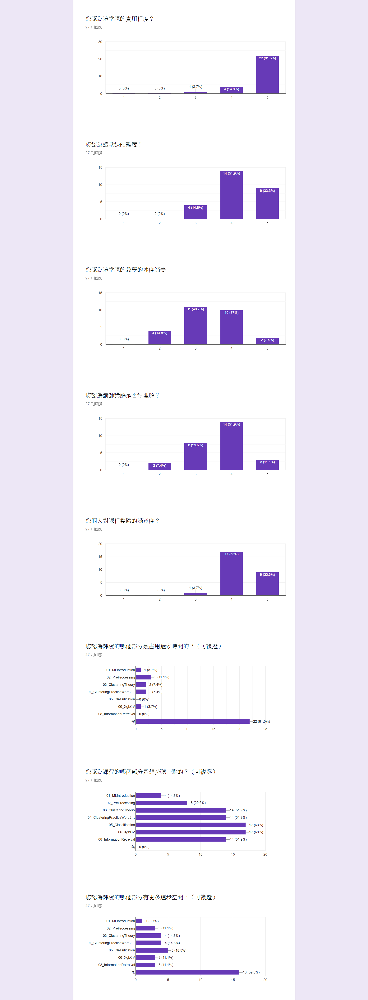

# 服用方式
1. prerequisite: 
    - python3.6 (**do not** use conda, python2.x and python3.7)
2. clone repo: ```git clone https://github.com/GoatWang/IIIMaterial```
3. install packages: ```pip install -r requirements.txt```
    - if you want to learn ML, its recommended to install all this packages in the system python3.6 (not virtualenv).
    - if you want to install in the virtualenv, make sure your jupyter is install in the system python3.6. Please refer to this [link](https://zhuanlan.zhihu.com/p/33257881), and in the venv:
    ```
    (venv)>>> pip install ipykernel
    (venv)>>> python -m ipykernel install --user --name=IIIMaterial
    ```
4. generate practice file:
    1. open jupyter notebook
    2. open practice_generator.ipynb
    3. run all cell
5. start practice
    1. open practice*.ipynb files in all dirs.
    2. (optional) modify practice\*.ipynb to add the date e,g, practice\*\_20181123.ipynb. This can make sure the new practice\*.ipynb file will not cover old one once you want to generate new practice\*.ipynb file 
    3. (optional) open main*.ipynb files to check the answer.
6. update: once I have modified the main file, you want to update to your code to you should pull the repo. 
    1. checkout all changes you made in main*.ipynb: ```git checkout */main*``` 
        - Its quite diffcult to solve git conflict in ipython notebook.
        - so be sure to checkout the changes on main*.ipyne first.
    2. pull repo: ```git pull```

# 作業
1. 11/13問卷網址: (disabled)~~https://goo.gl/forms/X0gKPnmTquu9XVBL2~~
2. 有人問我能不能分享自學程式的心路歷程，[這是我去年底寫的一篇文章](https://ithelp.ithome.com.tw/articles/10195825)，給你們參考。
2. 作業: 請自行使用07_RealEstatePractice進行探索分析並做出預測結果，請在同一分jupyter notebook的最上方的block整理出:
    1. 要求項目:
        - 自行計算出尚未取log的「真實total_price」跟「預測total_price」的rmse(40%)
        - 整理出使用課程上或課程外學到的哪一些「前處理」、「分群」、「分類」技術(60%)
    2. 加分項目:
        - 比較出各分類演算法在這份資料集上適用的差異與心得(20%)
    3. 繳交期限: 11/27(二)
    4. 資料集:以自己想練習的部分為主，想練習前處理的，可以玩未處理過的資料集(df_realestate.csv)，想多練習model的，可以玩已經做好處理的(df_realestate_processed.csv)。
    5. 繳交方式: 將repo push到自己的github上，並提供你github中這一個notebook的連結給統一個負責人，整理完後再轉交給我。

# 課程評價結果:

