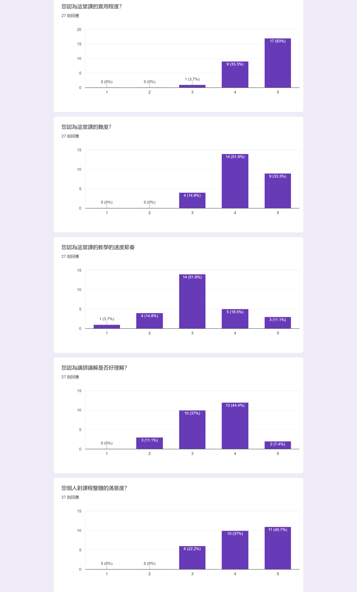

# 服用方式
## 先備知識: Numpy & Pandas
根據之前學長姊的評價這堂課的速度會與難度是前面其他課程的兩倍以上，**請務必複習好Numpy與Pandas的索引方式**，這是他們google表單留下的建議。


## prerequisite: git, python3.6, and jupyter.
### Installation Check
    - git
    ```
    > git
    usage: git [--version] [--help] [-C <path>] [-c name=value]
            [--exec-path[=<path>]] [--html-path] [--man-path] [--info-path]
            [-p | --paginate | --no-pager] [--no-replace-objects] [--bare]
            [--git-dir=<path>] [--work-tree=<path>] [--namespace=<name>]
            <command> [<args>]
    ......
    ```

    - python 3.6 (should be 3.6 and **do not** use conda, VS or python2.x): if you have installed conda or other version of python, you should modify **PATH** Variable in **系統環境變數** to keep using the right version of python. To open **系統環境變數** GUI in windows 10, please refer to this [link](http://kaiching.org/pydoing/py-guide/how-to-set-the-path-environment-variable-of-python-on-windows-10.html). You can remove all paths with other version of python under **PATH** Variable.
    ```
    > python -V
    Python 3.6.X
    > pip -V　# 注意最後面對應的python版本即可
    pip 10.0.1 from C:\Users\<UserName>\AppData\Local\Programs\Python\Python35\lib\site-packages\pip (python 3.6)
    ```

    - jupyter
    ```
    >>> jupyter --version # 有數字跑出來即可
    jupyter core     : 4.7.1
    jupyter-notebook : 6.4.0
    qtconsole        : 5.1.1
    ipython          : 7.25.0
    ipykernel        : 6.0.0
    jupyter client   : 6.2.0
    jupyter lab      : not installed
    nbconvert        : 6.1.0
    ipywidgets       : 7.6.3
    nbformat         : 5.1.3
    traitlets        : 5.0.5
    ```

### Istallation Guide (If you have not installed above software)
    - Git
        1. go to [official site](https://git-scm.com/download/win)
        2. download executable
        3. open executabled: Always "Next"
        4. testing
            ```
            > git 
            usage: git [--version] [--help] [-C <path>] [-c <name>=<value>]
                [--exec-path[=<path>]] [--html-path] [--man-path] [--info-path]
                [-p | --paginate | -P | --no-pager] [--no-replace-objects] [--bare]
                [--git-dir=<path>] [--work-tree=<path>] [--namespace=<name>]
                <command> [<args>]
            .........
            ```
    - Python3.6
        1. go to [python 3.6.4 download page](https://www.python.org/downloads/release/python-364/)(official site)
        
        2. Download "Windows x86-64 executable installer"
        3. Open installer
            1. (very important!!) check "Add Python 3.6 to PATH" at bottom
            
        4. testing:
            ```
            >>>python -V
            Python 3.6.4
            >>>pip -V
            pip 9.0.1 from C:\.......\pip (python 3.6)
            ```
    - Jupyter:
        1. Open terminal and type:
            ```
            > pip install --upgrade pip
            > pip install jupyter
            ```
        2. testing
            ```
            > jupyter notebook
            ```

## Python Packages Installation
1. clone repo: ```git clone https://github.com/GoatWang/IIIMaterial```

2. change directory into the repo: ```cd IIIMaterial```

3. Build virtual environment:
    ```
    > pip install virtualenv # install virtualenv python package 
    > virtualenv venv # build virtual environment with name venv
    > venv\Scripts\activate # activate the virtual environment
    (venv)> pip -V # check python location
    pip 21.1.2 from Path\To\IIIMaterial\venv\lib\site-packages\pip (python 3.6)
    ```

3. install packages: ```pip install -r requirements.txt```
    - Please try to install the packages in the virtualenv, make sure your jupyter is install in the system. and type the following command in the venv. For more information, please refer to this [link](https://zhuanlan.zhihu.com/p/33257881)):
    ```
    (venv)> pip install ipykernel
    (venv)> python -m ipykernel install --user --name=IIIMaterial
    ```

## Usage of this repo
This repo is used to introduce the maching learning algorithms in the aspect of theory and implementation. In order to practice writing the code more efficiently. The repo will not ask you to write the code from the start. Instead, some important part of the code will be removed automatically for you to do the practice.
1. generate practice file:```python practice_generator.py```

2. start practice
    1. open practice*.ipynb files in all dirs.
    2. (optional) modify practice\*.ipynb to add the date e,g, practice\*\_20181123.ipynb. This can make sure the new practice\*.ipynb file will not cover old one once you want to generate new practice\*.ipynb file 
    3. (optional) open main*.ipynb files to check the answer.

3. update: once I have modified the main file, you want to update to your code to you should pull the repo. 
    1. checkout all changes you made in main*.ipynb: 
        - if all changes are expected to ignore:
            ```git checkout .```
        - if you want to keep some changes:
            ```git checkout */main*``` 
            ```git checkout latex_generator/latex_generator.ipynb```
        - Its quite diffcult to solve git conflict in ipython notebook.
        - so be sure to checkout the changes on main*.ipyne first.
    2. pull repo: ```git pull```

## Note1: 課程評價


## Note2: Jupyter 快捷鍵
- shift-enter: 跑程式
- A: 上面增加一格
- B: 下面增加一格
- C: 複製
- V: 貼上
- Z: 復原
- shift-up & shift-down: 多個block選取
- M: markdown抄筆記
- shift + tab: param instruction
- tab: functions instruction


<!-- # 20200517課後訊息
1. 問卷地址: https://forms.gle/V2yDFf2MHS62siuFA
2. 非本科系轉職軟體工程師指南: https://medium.com/@jeremy455576/%E9%9D%9E%E6%9C%AC%E7%A7%91%E7%B3%BB%E8%BD%89%E8%81%B7%E8%BB%9F%E9%AB%94%E5%B7%A5%E7%A8%8B%E5%B8%AB%E6%8C%87%E5%8D%97-9c7783190178?source=friends_link&sk=8d0300a984fad9c950526a3a453c35e2 -->

<!-- # 20190901課後訊息
1. 問卷地址: https://docs.google.com/forms/d/e/1FAIpQLSe0BrMz2vmZW_X0aTY3qClrOKbkjj20Z2kotzuwE6IxbIUDyQ/viewform?usp=sf_link
2. kaggle專案網頁成品: http://realestateevaluator-dev.ap-southeast-1.elasticbeanstalk.com/evaluator/
3. 講師自學程式的心路歷程: https://ithelp.ithome.com.tw/articles/10195825 -->

<!-- # 20190331課後訊息
1. 問卷網址: https://docs.google.com/forms/d/e/1FAIpQLScDHxoRzLMz1UES_xPoq4-ZRPs5EiOvfGc1YzuNlIYiE6n6TA/viewform?usp=sf_link
2. kaggle競賽: https://www.kaggle.com/t/94b12368cbce4c65a2b4ea4be059e312
3. kaggle專案網頁成品: http://realestateevaluator-dev.ap-southeast-1.elasticbeanstalk.com/evaluator/
4. 講師自學程式的心路歷程: https://ithelp.ithome.com.tw/articles/10195825 -->

<!-- 
# 11/11課後訊息
1. 11/13問卷網址: (disabled)~~https://goo.gl/forms/X0gKPnmTquu9XVBL2~~
2. 有人問我能不能分享自學程式的心路歷程，[這是我去年底寫的一篇文章](https://ithelp.ithome.com.tw/articles/10195825)，給你們參考。
2. 作業: 請自行使用07_RealEstatePractice進行探索分析並做出預測結果，請在同一分jupyter notebook的最上方的block整理出:
    1. 要求項目:
        - 自行計算出尚未取log的「真實total_price」跟「預測total_price」的rmse(40%)
        - 整理出使用課程上或課程外學到的哪一些「前處理」、「分群」、「分類」技術(60%)
    2. 加分項目:
        - 比較出各分類演算法在這份資料集上適用的差異與心得(20%)
    3. 繳交期限: 11/27(二)
    4. 資料集:以自己想練習的部分為主，想練習前處理的，可以玩未處理過的資料集(df_realestate.csv)，想多練習model的，可以玩已經做好處理的(df_realestate_processed.csv)。
    5. 繳交方式: 將repo push到自己的github上，並提供你github中這一個notebook的連結給統一個負責人，整理完後再轉交給我。 -->

<!-- # 11/11課程評價結果:
 -->


